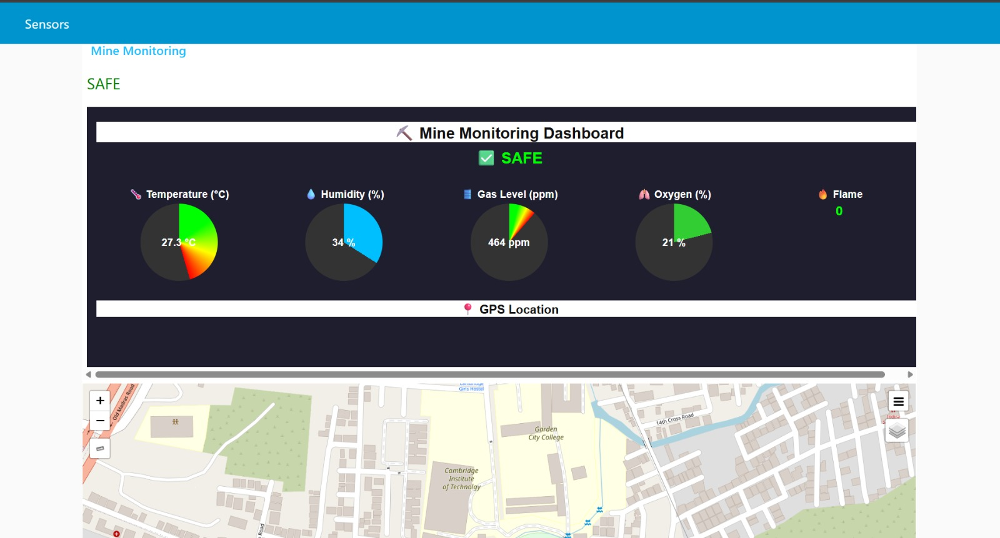

# Mine Monitoring Dashboard

This project uses **Arduino (ESP32)** and **Node‑RED** to monitor environmental conditions in a mine.

## Hardware
- ESP32
- DHT11 (temperature & humidity)
- MQ gas sensor
- Flame sensor
- GPS module
- LCD display
- Buzzer

## Software
- Arduino IDE
- Node‑RED
- MQTT broker (HiveMQ)

## Setup
1. Flash `final.ino` to ESP32 using Arduino IDE.
2. Import `flows.json` into Node‑RED editor.
3. Run Node‑RED and open the dashboard.
4. Monitor temperature, humidity, gas, oxygen, flame, and GPS location.

## Screenshots

## Future Work
- Add real oxygen sensor support.
- Improve alert notifications.
